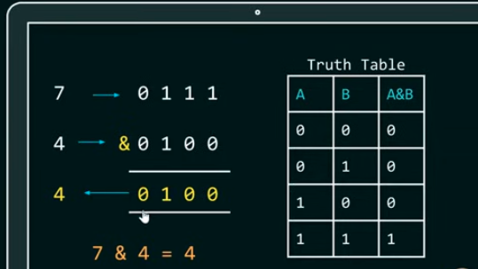
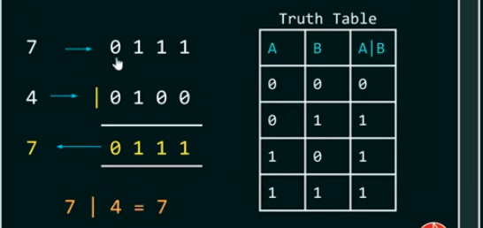
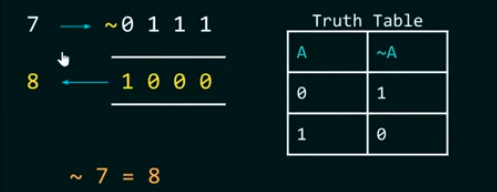
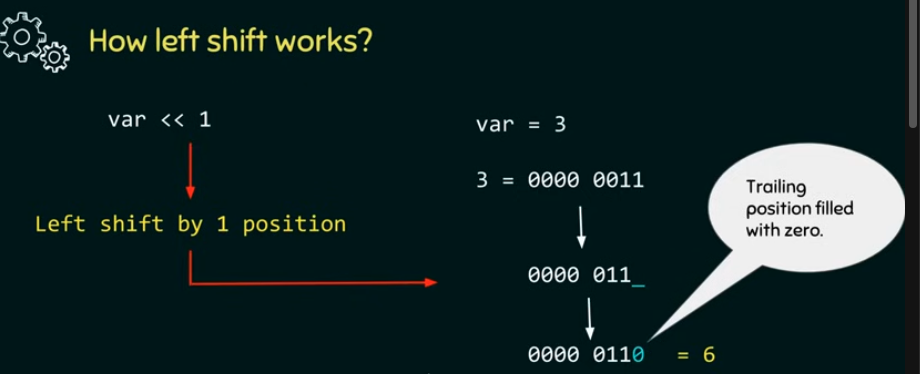
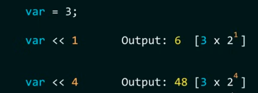
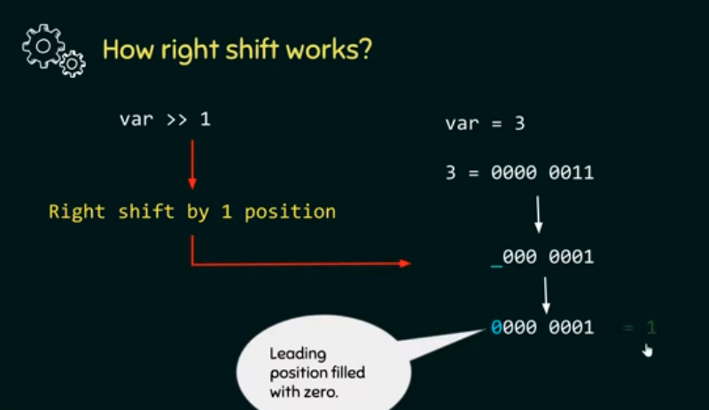
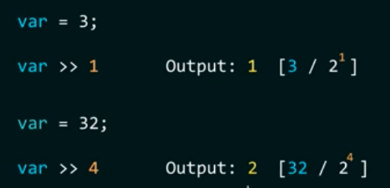
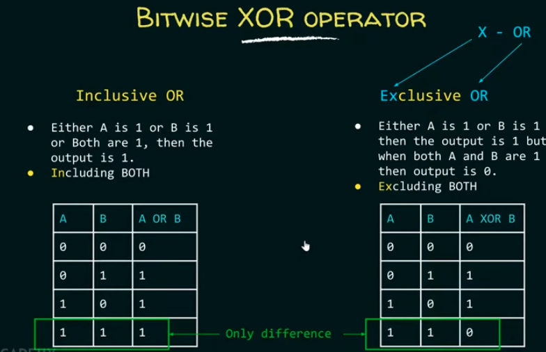
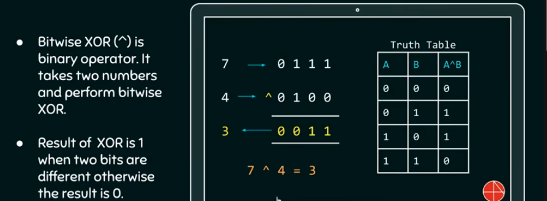

##### Bitwise_operators
As name suggests - it does bitwise manipulation.
6 operators:
&,|,~,<<,>>,^
##### Bitwise And(&) operator
- it takes two bits at a time and perform AND operation.
- AND(&) is binary operator. it takes two numbers and perform bitwise AND.
- result of AND is 1 when both bits are 1.

##### Bitwise OR(|) operator
- it takes two bits at a time and perform OR operation.
- OR (|) is binary operator. it takes two numbers and perform bitwise OR.
- result of OR is 0 when both bits are 0.

##### Bitwise NOT (~) Operator
- not is a unary operator.
- its job is to complement each bit one by one.
- result of not is 0 when bit is 1 and 1 when it is 0.

##### left shift operator
- syntax: 
first operand << second operand
first operand - whose bits get left shifted.
second operand- decides the number of places to shift the bits.
1.when bits are shifted left then trailing positions are filled with zeros.
##### example1:
```c
#include<stdio.h>
int main()
{
    char var = 3;
    //3 in binary=0000 0011
    printf("%d",var<<1);
    return 0;
}
```
##### how left shift operator works:

2.left shifting is equivalent to multiplication by 2^right operand

##### Right shift operator
- syntax: 
first operand >> second operand
first operand - whose bits get right shifted.
second operand- decides the number of places to shift the bits.
1.when bits are shifted left then leading positions are filled with zeros.
##### example2:
```c
#include<stdio.h>
int main()
{
    char var = 3;
    //3 in binary=0000 0011
    printf("%d",var>>1);
    return 0;
}
```
##### how right shift operator works:


2.right shifting is equivalent to division by 2^right operand

##### Bitwise xor operator


##### example3:
```c
#include<stdio.h>
int main()
{
    int a=4,b=3;
    a=a^b;
    b=a^b;
    a=a^b;
    printf("After XOR,a=%d and b=%d",a,b);
    return 0;
}
```