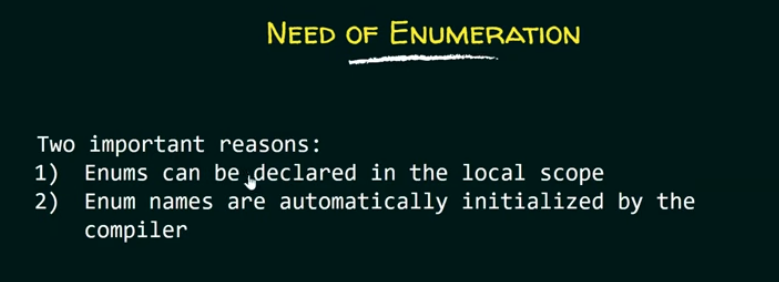
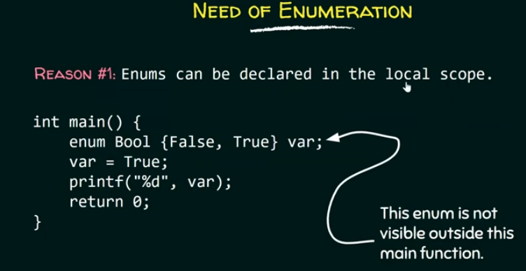
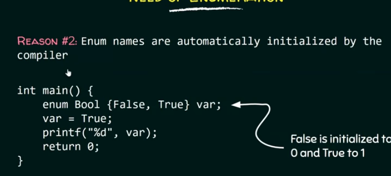
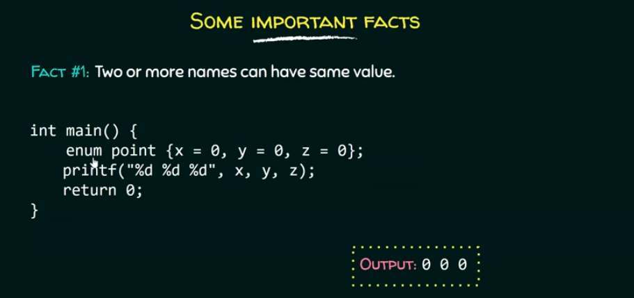
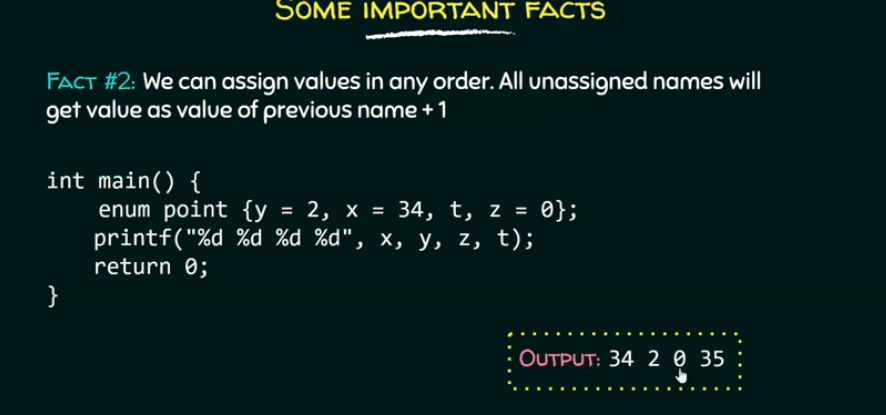
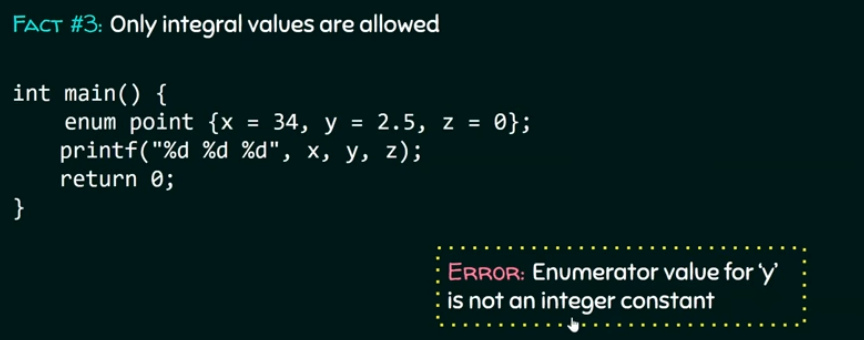
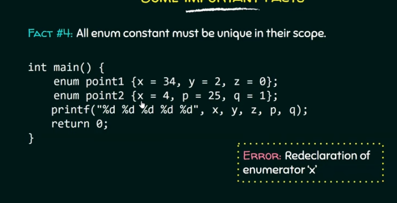

# Enumeration
- an enumerted type is a user defined type which is used to assign names to integral constants because names are easier to handle in program.
# example1
```c
#include<stdio.h.>
enum Bool{False,True};
int main(){
    enum Bool var;
    var=True;
    printf("%d",var);
    return 0;
}
```
-here false and true are the integral constants.
-if we do not assign values to enum names then ,automatically compiler will assign values to them starting from 0.
fere false=0 and true =0+1=1
 BUT we can also use #define to assign names to integral constants.then,why do we even need enum?
 








