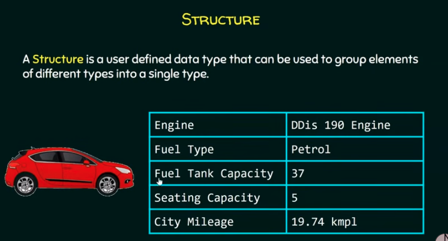
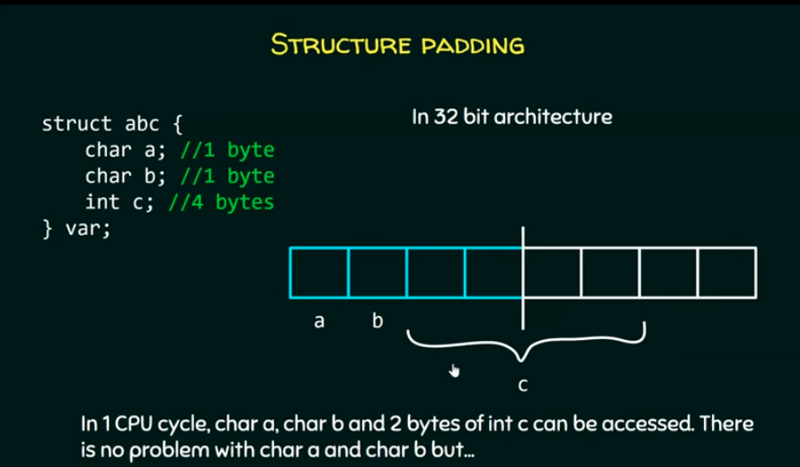
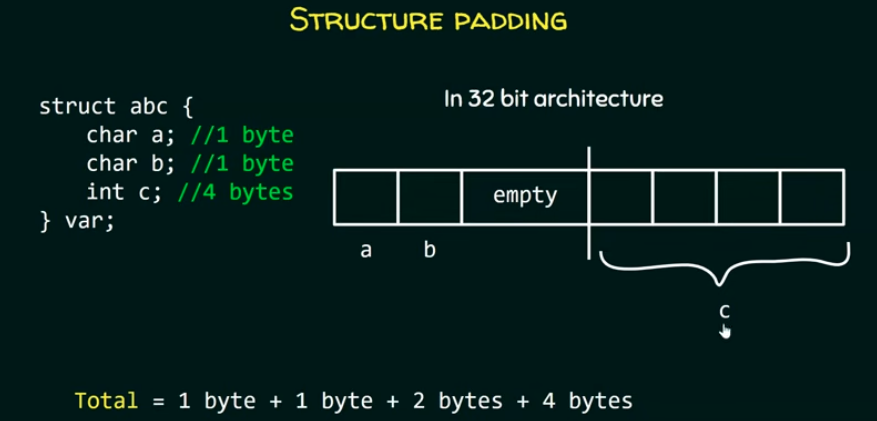
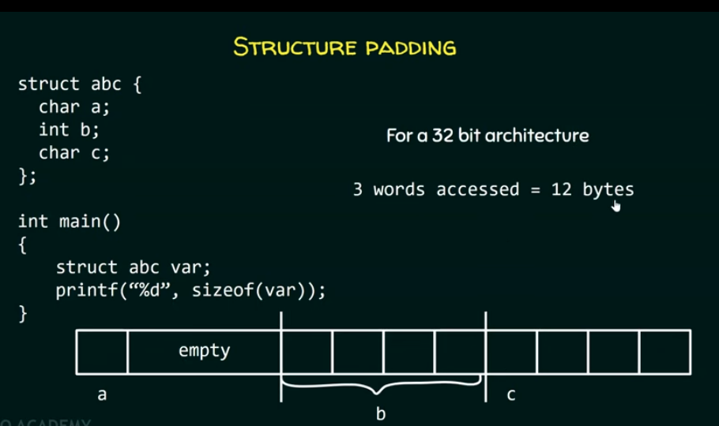
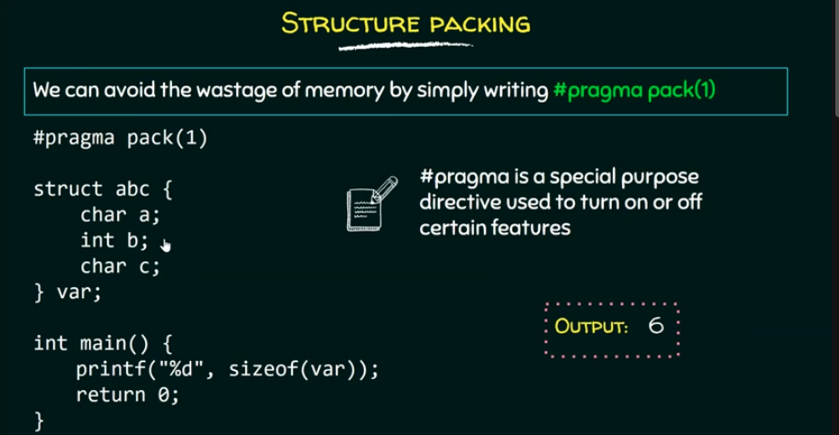

#STRUCTURE
A structure is a  user defined data type that can be used to group elements of different types into a single type.

#example
struct{
    char *engine;
    char *fuel_type;
    int fuel_tank_cap;
    int seating_cap;
    float city_mileage;
}car1,car2;

#example1

#include<stdio.h>
struct{
char *engine;
}car1,car2;
int main()
{
car1.engine = "DDis 190 Engine";
car2.engine = "1.2 L Kappa Dual VTVT";
printf("%s\n",car1.engine);
printf("%s",car2.engine);
return 0;
}
-structure is in global scope as we have see it is outside main.
-here we have declared two variables car1 and car2.
-with the help of . operator we are accessing member of the structure
#structure types-using structure tag
#structure in the local scope
#example2
#include<stdio.h>
struct{
    char *name;
    int age;
    int salary;
}emp1,emp2;
int manager()
{//structure i local scope
    struct{
        char *name;
        int age;
        int salary;
    }manager;
    manager.age =27;
    if(manager.age>30)
    manager.salary=65000;
    else
    manager.salary=55000;
    return manager.salary;
    }
int main()
{
    printf("enter the salary of employee1:");
    scanf("%d",&emp1.salary);
    printf("enter the salary of employee2:");
    scanf("%d",&emp2.salary);
    printf("employee 1 salary is :%d\n",emp1.salary);
    printf("employee 2 salary is :%d\n",emp2.salary);
    printf("managers salary is :%d\n",manager());
    return 0;
}
in this way we can create a structure in local scope
-we create a one structure n global scope andanother structure in local scope.
-we can also see it clearly that there is a redundancy in the code if the manager variable to be declated at global structure.then there is no problem.
-but if we want a variable to be declared in the local scope then we have to redeclare the whole thing within that particular function .this structure have to be written once again within this function.
-Instead of writeing structures once again we can create a type of the structure and after writeing the type we can declare variables within the functions.(structure tag)
-with the help of structure tag we are basically creating a type of the structure .
#example3
#include<stdio.h>
struct employee{//structure tag
    char *name;
    int age;
    int salary;
};
int manager()
{struct employee manager;
    manager.age =27;
    if(manager.age>30)
    manager.salary=65000;
    else
    manager.salary=55000;
    return manager.salary;
    }
int main()
{struct employee emp1;
struct employee emp2;
    printf("enter the salary of employee1:");
    scanf("%d",&emp1.salary);
    printf("enter the salary of employee2:");
    scanf("%d",&emp2.salary);
    printf("employee 1 salary is :%d\n",emp1.salary);
    printf("employee 2 salary is :%d\n",emp2.salary);
    printf("managers salary is :%d\n",manager());
    return 0;
}
#structure tag
-structure tag is used to identify a particular kind of structure.

#structure types - using typedef
syntax: typedef existing_data_type new_data_type
-typedef gives freedom to the user by allowing them to create their own types.
for example:
#include<stdio.h>
typedef int INTEGER;
int main()
{
    INTEGER var =100;
    printf("%d",var);
    return 0;
}
we can declare struction in two ways
-structure declaration
struct car{
    char *engine;
    char *fuel_type;
    int fuel_tank_cap;
    int seating_cap;
    float city_mileage;
}c1;
-separate Declaration
struct car{
    char *engine;
    char *fuel_type;
    int fuel_tank_cap;
    int seating_cap;
    float city_mileage;
};
int main()
{
    struct car c1;}

-Instead of writeing struct car every time we can write our own type
typedef struct car{
    char *engine;
    char *fuel_type;
    int fuel_tank_cap;
    int seating_cap;
    float city_mileage;
}car;//car becomes a new data type
int main()
{
    car c1;
}
-here struct car is old type and car is new type

#initializing_structure_variables_and_accessing_members_of_structure
#not_allowed
struct abc{
    int p=23;
    int q=34;};
-wrong way of initialization
#allowed
struct abc{
    int p;
    int q;
};
int main()
{
    struct abc x={23,34};
}

#EXAMPLE
struct car{
    char *engine;
    char *fuel_type;
    int fuel_tank_cap;
    int seating_cap;
    float city_mileage;
};
int main()
{
struct car c1={"DDis 190 Engine","Diesel",37,5,19.74}
struct car c2={"Kappa","petrol",22,8,14.5};
}
-two cars with same properties but different values.
#Accessing_mambers_of_structure
-we can access members of the structure using (.) operator.
#example4
struct car{
    int fuel_tank_cap;}c1,c2;
int main()
{
    c1.fuel_tank_cap  =45;
    c2.fuel_tank_cap =30;
    printf("%d %d",c1.fuel_tank_cap,c2fuel_tank_cap);
    return 0;
}
#structure_designated_initialization
designated initialization allows structure members to be initialized in any order.
#example5
struct abc{
    int x;
    ibt y;
    int z;
};
int main()
{
    struct abc a={.y=20,.x=10,.z=30};
    printf("%d %d %d",a.x,a.y,a.z);
    return 0;}
-don't forget to use dot operator while accessing the menbers of the structure.
#ARRAY_OF_STRUCTURE
-instead of declaring multiple variables ,we can also declare an array of structure in which element of the array will represent a structure variable.
#EXAMPLE6
#include<stdio.h>
struct car{
    int fuel_tank_cap;
    int seating_cap;
    float city_mileage;};
    int main()
    {
        struct car c[2];
        int i;
        for(i=0;i<2;i++)
        {printf("enter the car %d fuel tank capacity:",i+1);
        scanf("%d",&c[i].fuel_tank_cap);
        printf("enter the car %d seating capacity:",i+1);
        scanf("%d",&c[i].seating_cap);
        printf("enter the car %d city mileage:",i+1);
        scanf("%d",&c[i].city_mileage);}
    
printf("\n")
for(i=0;i<2;i++)
{
    printf("\nCar %d details:\n",i+1);
    printf("fuel tank capacity:%d\n",c[i].fuel_tank_cap);
    printf("seating capacity:%d\n",c[i].seating_cap);
    printf("city milesge:%f\n",c[i].city_mileage);

}
return 0;}
#Accessing_members_of_structure_using_structure_pointer
#example7
#include<stdio.h>
struct abc
{
    int x;
    int y;
};
int main()
{
    struct abc a={0,1};
    struct abc *ptr=&a;
    //ptr is pointer to some variable of type struct abc.
    printf("%d %d",ptr->x,ptr->y);
    //ptr->x is equvalent to (*ptr).x 
    //ptr->x is equvalent to (*&a).x
    //* and & cancel out we lft with a.x
    //a.x=0 and similarly a.y =1

    return 0;
}
#structure_padding_in_c
how memory is allocated to structure members?
-when an object of some structure type is declared then some contiguous block of memory will be allocated to structure members
#example
struct abc{
    char a;
    char b;
    int c;
}var;
here var is the object
what is the size of struct abc?
#calculating_the_size_of_the_struct
let the size of int is 4 bytes and size of char is 1 byte.
then 1+1+4=6 bytes of memory
but it is wrong
-there is a concept called structure padding.
#structure_padding
-processor does not read 1 byte at a time from memory.
it reads 1 word at a time.
-if we have a 32 bit processor then it means it can access 4 bytes at a time which means word size is 4 bytes.
-if we have a 64 bit processor then it means it can access 8 bytes at a time which means word size is 4 bytes.

-but whenever we want the value stored in variable c,2 cycles are required to access the contents of variable c.in first cycle,1st 2 bytes can be accessed and in 2 nd cycle,last 2 bytes. 
-its an unneccessary wasteage of cpu cycles.
-we can save the number of cycles by using the concept called padding.

so total number of bytes are 8 bytes
#example8
#include<stdio.h>
struct abc{
    char a;
    char b;
    int c;
};
int main()
{
    struct abc var;
    printf("%d",sizeof(var));
}

BUT what happens if we change the order of members?
#example9
#include<stdio.h>
struct abc{
    char a;
    int b;
    char c;
};
int main()
{
    struct abc var;
    printf("%d",sizeof(var));
}

#structure_packing_in_c
-because of structure padding,size of the structure becomes more then the size of the actual structure.due to this some memory get wasted.

#example10
#example9
#include<stdio.h>
#pragma pack(1)
struct abc{
    char a;
    int b;
    char c;
};
int main()
{
    struct abc var;
    printf("%d",sizeof(var));
}

