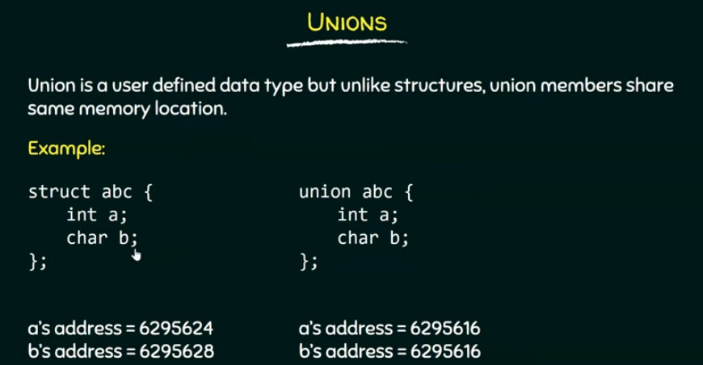
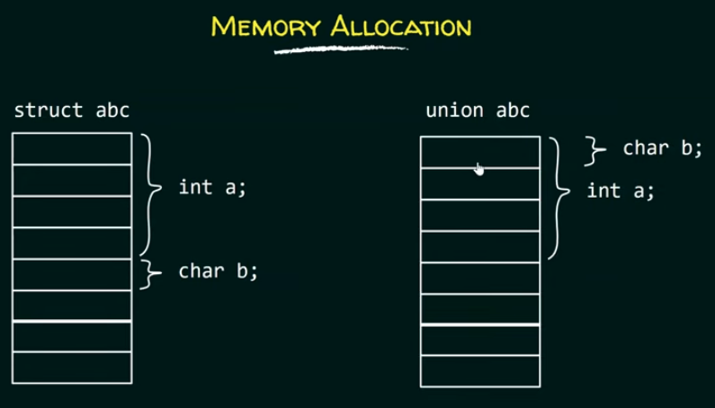
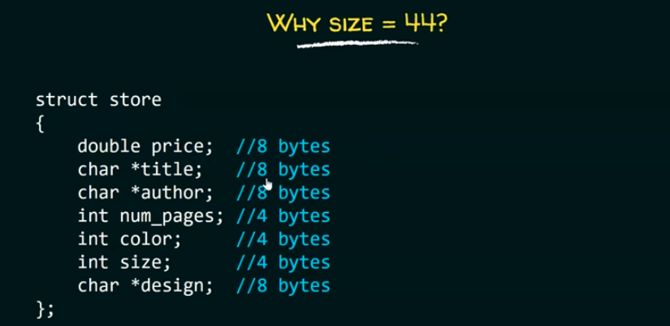
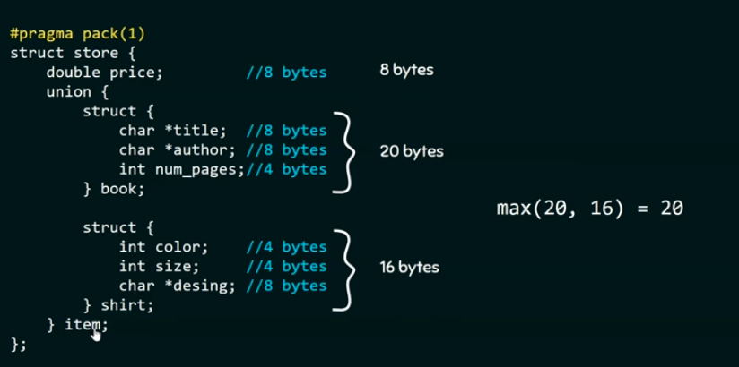
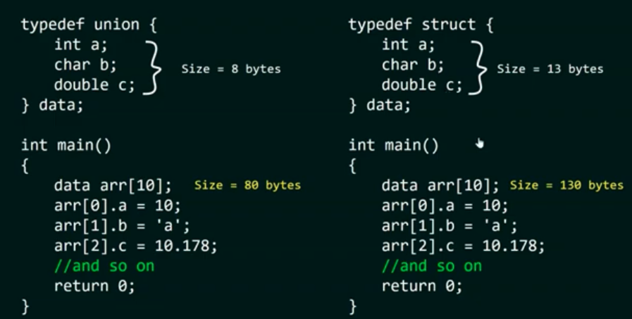

# unions


#fact
-In union ,members will share same memory location.if we make changes in one member then it will be reflected to other member as well.
#example1
```c
#include<stdio.h>
union abc {
    int a;
    char b;
}var;
int main()
{
    var.a=65;
    printf("a=%d\n",var.a);
    printf("b=%c",var.b);
    return 0;
}
```

# deciding_the_size_of_union
-size of the union is taken according to he size of the largest member of the union.
# example2
```c
#include<stdio.h>
union abc{
    int a;
    char b;
    double c;
    float d;
};
int main()
{printf("%ld",sizeof(union abc));
return 0;}
```

# accessing_members_using_pointers
-we can access members of union through pointers by using the arrow (->) operator.
# example3
```c
#include<stdio.h>
union abc{
    int a;
    char b;
};
int main()
{
    union abc var;
    var.a=90;
    union abc *p=&var;
    printf("%d %c",p->a,p->b);
    return 0;
}
```
# Application_of_unions

initially they decided to create a structure like below.
```c
#include<stdio.h>
struct store
{
    double price;
    char *title;
    char *author;
    int num_pages;
    int color;
    int size;
    char *design;
};
```
this structure is perfectly usable but only price is commom property in both the items and rest all individual
# accessing_mambers_of_the_structure
```c
#include<stdio.h>
struct store
{
    double price;
    char *title;
    char *author;
    int num_pages;
    int color;
    int size;
    char *design;
};
int main()
{
    struct store book;
    book.title="the alchemist";
    book.author="hgg";
    book.num_pages=197;
    book.price=23;//in dollars
    return 0;
    }
```
but 
 int color;
    int size;
    char *design; 
    above 3 properties 
    book variable does not possess.therefore ,its a wastage of memory.

# example4
```c
    #include<stdio.h>
    #pragma pack(1)
    struct store
{
    double price;
    char *title;
    char *author;
    int num_pages;
    int color;
    int size;
    char *design;
};
int main()
{
    struct store book;
    printf("%ld bytes",sizeof(book));
    return 0;
}
```


we can save lot of space if we start using unions
# example5
```c
#include<stdio.h>
#pragma pack(1)
struct store{
    double price;
    union{
        struct{
            char *title;
            char *author;
            int num_pages;
        }book;
        struct{
            int color;
            int size;
            char *design;
        }shirt;
    }item;
};
int main()
{
    struct store s;
    s.item.book.title="the alchemist";
    s.item.book.author="paulo coelho";
    s.item.book.num_pages=197;
    printf("%s\n",s.item.book.title);
    printf("%ld",sizeof(s));
    return 0;
}
```

total 20+8=28 bytes
# array_Of_mixed_type_data
```c
#include<stdio.h>
typedef union {
    int a;
    int b;
    double c;
}data;
int main()
{
    data arr[10];
    arr[0].a=10;
    arr[1].b='a';
    arr[2].c=10.178;
    //and so on
    return 0;
}
```
here we are successful in createing an array containing mixed type data
why not structures?


