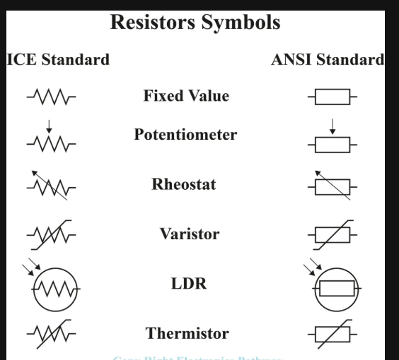
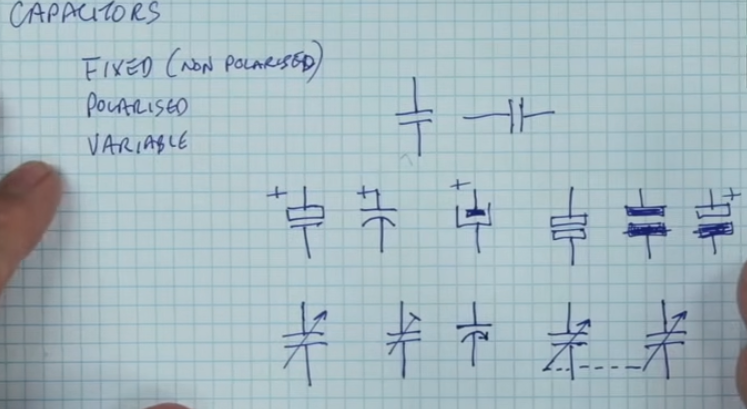
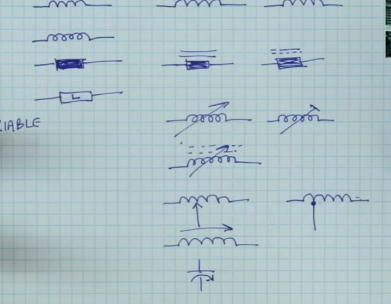
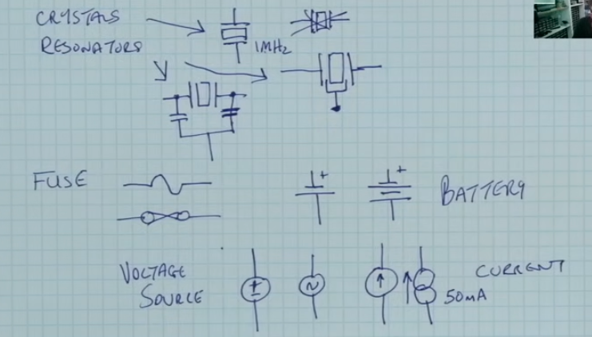
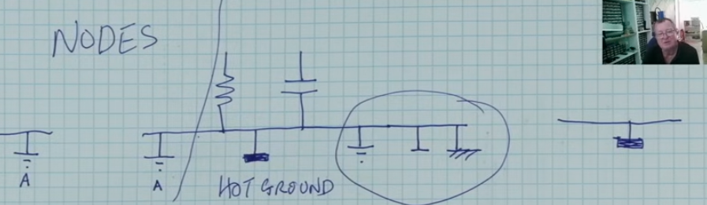
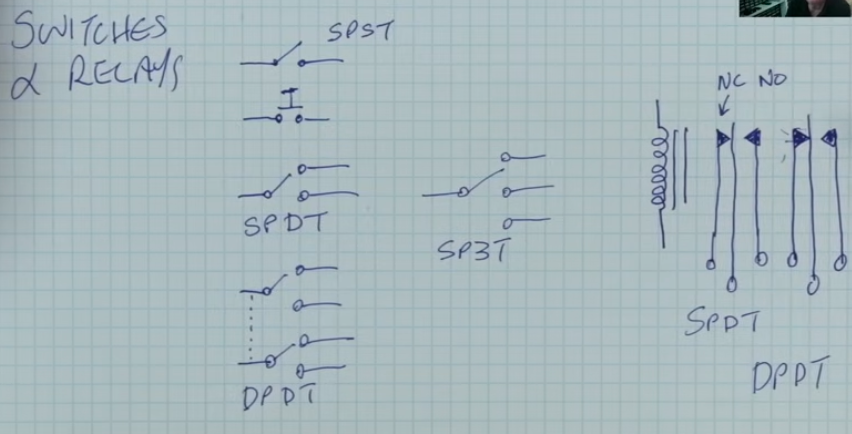
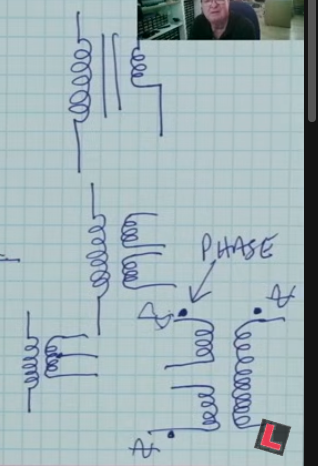

These notes summarize the key concepts from the video "How to Read Schematics," focusing on the symbols used to represent passive and pseudo-passive components.

### **Introduction to Schematics**
*   **Definition:** A schematic is a diagram representing a circuit's interconnections rather than its physical layout on a board.
*   **Reference Designators:** Components are identified by letters and numbers (e.g., R108, C83) that indicate their **location** on the board's silk screen, not their value.
*   **Interconnections:** Lines represent the physical wires or tracks on a printed circuit board.
*   **Component Classes:** Components are broadly divided into **Passive** (resistors, capacitors, inductors) and **Active** (to be covered in a later part).

---

### **1. Resistors (R)**
Resistors limit current and are found in almost every schematic.

*   **Fixed Resistor:** Represented by either a **zigzag line** or a **simple rectangular box**.
*   **Variable Resistor (Potentiometer):** Features a resistor symbol with a **diagonal arrow** or a **slider line**.
*   **Tapped Resistor:** A vintage style with lines branching off the main body for fixed intermediate values.
*   **Trimmer (Trim Pot):** A resistor with a **long "T" shape** through it, used for internal calibration.
*   **LDR (Light Dependent Resistor):** A resistor symbol with **arrows pointing inward**, signifying it is light-sensitive.
*   **Thermistor:** Changes resistance based on temperature. **NTC** decreases resistance as it gets hotter, while **PTC** increases it.
*   **Varistor (MOV):** A voltage-dependent resistor used for protection.

---

### **2. Capacitors (C)**
Capacitors store energy and come in polarized or non-polarized varieties.

*   **Non-Polarized:** Two **parallel lines**; these can be connected in any direction.
*   **Polarized (Electrolytic):** One **straight line and one curved line**, or two lines with a **"+" sign**. The straight line is the positive terminal.
*   **Variable/Trimmer:** Indicated by a **diagonal arrow** (variable) or a **"T" shape** (trimmer).
*   **Ganged:** Two capacitors connected by a **dotted line**, indicating they are adjusted simultaneously by the same shaft.

---

### **3. Inductors & Transformers (L, T)**
Inductors represent coils of wire, and transformers represent multiple windings on a shared core.

*   **Base Symbols:** Drawn as **loops/coils**, a **filled box**, or a box containing the **letter "L"**.
*   **Core Types:** **Solid lines** above the symbol indicate an iron core; **dotted lines** indicate a ferrite core.
*   **Phasing Dots:** Small dots near transformer windings indicate the **phase relationship** (whether the signal is inverted).

---

### **4. Switches & Relays (S, SW, K)**
These symbols show the mechanical state of connections.

*   **SPST:** A simple break in a line with a **hinged segment**.
*   **SPDT:** One input that toggles between **two different output lines**.
*   **Push Button:** A symbol depicting a **physical button structure** above the contacts.
*   **Relay:** Combines a **coil symbol** (inductor) with switch contacts. **NC** stands for Normally Closed, and **NO** stands for Normally Open.

---

### **5. Miscellaneous Passive Components**
*   **Crystals/Resonators (Y, X):** A **rectangle between parallel lines** (crystal) or similar shapes with three pins (resonator).
*   **Fuses (F):** A **wavy line** or a **box with a line through it**.
*   **Batteries (B, BT):** A series of **long and short parallel lines**; the long line is always **positive**.
*   **Power Sources:** **Circles** containing arrows (current source) or plus/minus signs (voltage source).

---

### **6. Nodes (Ground & Supply)**
Nodes are shorthand symbols used to simplify diagrams and avoid "rat's nest" wiring.

*   **Ground (GND):** 
    *   **Safety/Earth:** Three horizontal lines in a pyramid shape.
    *   **Chassis Ground:** A "rake" shape.
    *   **Hot Ground:** A **solid triangle**, often used in power supplies as a reference point that is not a safety ground.
    *   **Analog/Audio Ground:** Often a variation (like a rake) to separate signal noise from the main ground.
*   **Supply Nodes:** **Arrows or circles** labeled with voltages (e.g., **VCC**, **+5V**). All points with the same label are electrically connected.

