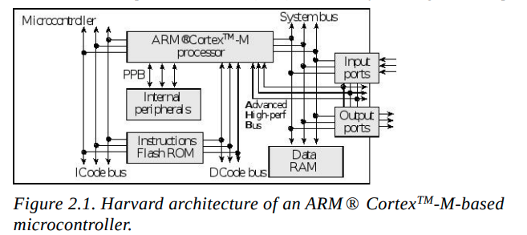

# Step 1: What is a Microcontroller?

Imagine you want to build an automatic door.

You'll need:

* A brain to make decisions.
* Memory to store the program.
* Temporary memory while the program runs.
* Pins to connect sensors and motors.
* A way for all these parts to communicate.

All of these are inside **one chip**, called a **microcontroller (MCU)**.

The figure shows what is inside that chip.

```
                Microcontroller
+------------------------------------------------+
| CPU | Flash | SRAM | GPIO | Timers | UART | ADC |
+------------------------------------------------+
```

---

# Step 2: The CPU is the Brain

In the centre of the figure is

```
ARM Cortex-M Processor
```

This is the **CPU core**.

Think of it as a person sitting in an office.

The CPU **doesn't store the program**.

The CPU **doesn't store variables**.

The CPU simply:

```
Read instruction

↓

Execute instruction

↓

Read next instruction

↓

Execute

↓

Repeat millions of times every second
```

---

# Step 3: Where is the Program Stored?

Look at the left side.

```
Flash ROM
```

This stores your program permanently.

Example:

```c
int main()
{
    LED_ON();
}
```

When you compile and flash your code,

it is stored here.

Even if power is removed,

Flash remembers the program.

---

# Step 4: How Does the CPU Read the Program?

Notice this line.

```
ICode Bus
```

A **bus** is simply a collection of wires that carries information.

```
Flash

────── ICode Bus ──────► CPU
```

The CPU continuously asks Flash:

```
Give me the next instruction.
```

Flash sends

```
MOV

ADD

SUB

STR

LDR
```

one instruction at a time.

---

# Step 5: Where Are Variables Stored?

Now look at

```
Data RAM
```

Suppose your program has

```c
int temperature = 25;
```

That variable is stored in **SRAM**.

The CPU reads and writes variables here.

```
CPU

↓

System Bus

↓

RAM
```

Unlike Flash,

RAM loses everything when power is removed.

---

# Step 6: Why Two Different Memories?

Imagine a student.

One shelf contains textbooks.

Another desk contains rough work.

```
Textbook

↓

Permanent

↓

Flash
```

```
Notebook

↓

Temporary

↓

RAM
```

The CPU reads instructions from Flash

and stores temporary data in RAM.

---

# Step 7: What is Harvard Architecture?

This is the main point of the figure.

Older processors had

```
One road
```

Both instructions and data used the same road.

```
CPU

↓

Bus

↓

Flash & RAM
```

Only one thing could travel at a time.

---

ARM Cortex-M uses

```
Two roads
```

```
Instruction Road

CPU ◄──── Flash
```

and

```
Data Road

CPU ◄──── RAM
```

Now the CPU can

* fetch the next instruction
* read/write data

**at the same time**.

That makes it much faster.

This is called

**Harvard Architecture**.

---

# Step 8: What is the System Bus?

Look at the right.

```
System Bus
```

Everything connects here.

```
CPU

↓

System Bus

↓

RAM

↓

GPIO

↓

UART

↓

ADC

↓

Timers
```

Think of it as a highway inside the microcontroller.

---

# Step 9: What are Input Ports?

These are pins receiving information.

Examples

```
Button

↓

Temperature Sensor

↓

Light Sensor

↓

Switch
```

The CPU reads these pins.

Example

```c
if(button==1)
```

The CPU gets that value through the system bus.

---

# Step 10: What are Output Ports?

Output pins send signals outside the chip.

Examples

```
LED

Motor

Relay

Buzzer

Display
```

Suppose

```c
LED_ON();
```

The CPU writes to the GPIO register.

That signal reaches the output pin.

The LED turns ON.

---

# Step 11: What are Internal Peripherals?

These are hardware modules inside the MCU.

Examples

```
UART

SPI

I²C

ADC

Timers

PWM

Watchdog
```

Instead of building these in software,

the chip has dedicated hardware.

The CPU simply configures them.

---

# Step 12: What is the PPB (Private Peripheral Bus)?

The PPB connects the CPU to **core-specific peripherals** that control the processor itself.

Examples include:

* **NVIC** (Nested Vectored Interrupt Controller)
* **SysTick Timer**
* **System Control Block (SCB)**

These peripherals are closely tied to the CPU, so they communicate over the **Private Peripheral Bus** rather than the general system bus.

```
CPU

↓

PPB

↓

NVIC

SysTick

SCB
```

---

# Step 13: What is the DCode Bus?

The DCode bus provides another path used for:

* Reading constants stored in Flash.
* Accessing debugging hardware.
* Supporting breakpoint and watchpoint features during development.

Most application programmers don't use it directly, but it helps the processor and debugger work efficiently.

---

# Step 14: What is the Advanced High-Performance Bus?

Some peripherals need to transfer data much faster than ordinary GPIO.

Examples:

```
USB

Ethernet

High-speed DMA
```

These connect through a faster internal bus (shown in the figure) so they don't slow down the rest of the system.

---

# Step 15: What is the NVIC?

The **Nested Vectored Interrupt Controller (NVIC)** manages interrupts.

Imagine you're writing code:

```
while(1)
{
    Read Temperature;
}
```

Suddenly, someone presses a button.

Instead of waiting for your loop to notice, the hardware tells the CPU immediately.

```
Button Press

↓

NVIC

↓

CPU

↓

Interrupt Service Routine (ISR)
```

This allows the CPU to respond in **microseconds**, which is why interrupts are much faster than continuously checking (polling).

---

# Step 16: Putting It All Together

Imagine this simple program:

```c
while(1)
{
    if(button)
        LED_ON();
}
```

Here's what happens inside the microcontroller:

```
Program stored in Flash
          │
          ▼
CPU fetches instructions using the ICode Bus
          │
          ▼
CPU reads the button through the System Bus
          │
          ▼
CPU processes the condition
          │
          ▼
CPU writes to the GPIO output through the System Bus
          │
          ▼
LED turns ON
```

---

# Summary of Each Block

| Block                         | Purpose                                                    |
| ----------------------------- | ---------------------------------------------------------- |
| ARM Cortex-M Processor        | Executes instructions and controls the MCU                 |
| Flash ROM                     | Stores the program permanently                             |
| Data RAM                      | Stores variables and temporary data                        |
| ICode Bus                     | Carries instructions from Flash to the CPU                 |
| System Bus                    | Connects the CPU to RAM and peripherals                    |
| DCode Bus                     | Supports Flash data access and debugging                   |
| PPB                           | Connects the CPU to core peripherals like NVIC and SysTick |
| Internal Peripherals          | Hardware modules such as timers, UART, SPI, I²C, ADC, PWM  |
| Input Ports                   | Receive signals from external devices (buttons, sensors)   |
| Output Ports                  | Send signals to external devices (LEDs, motors, buzzers)   |
| Advanced High-Performance Bus | High-speed path for demanding peripherals like USB         |
| NVIC (via PPB)                | Handles interrupts efficiently                             |

