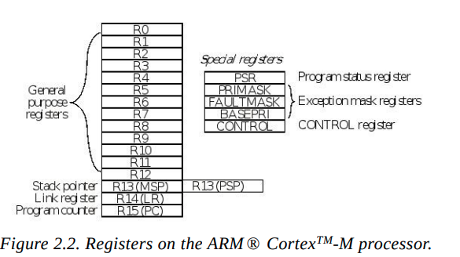
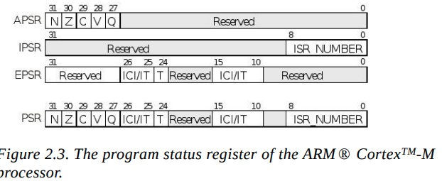

# 2.1.1 Registers

## What is a Register?

Imagine you are solving a math problem.

Suppose you want to calculate

```
25 + 15
```

Do you first write the numbers on the hard disk?

No.

You keep them **in your mind** while calculating.

A **register** is exactly like the CPU's mind.

It is a **very small**, **very fast** storage location inside the CPU.

Registers are much faster than RAM.

---

## Real-life example

Imagine a chef.

The chef has

* Refrigerator → Stores ingredients (RAM)
* Kitchen shelf → Stores spices (Cache)
* Hands → Hold ingredients while cooking (Registers)

The chef doesn't keep opening the refrigerator every second.

He keeps ingredients in his hands.

Registers are the CPU's hands.

---

# ARM Cortex-M Registers

The Cortex-M processor has

```
R0
R1
R2
...
R12
```

These are called

**General Purpose Registers**

They can store

* numbers
* addresses
* intermediate calculations

---

Example

```c
int a = 10;
int b = 20;
int c = a + b;
```

The compiler may do something like

```
R0 = 10
R1 = 20
R2 = R0 + R1
```

Now

```
R2 = 30
```

---

# Why not directly use RAM?

RAM is slower.

Registers are inside the CPU.

```
Register access
≈ 1 CPU cycle

RAM access
≈ several CPU cycles
```

So the CPU always prefers registers.

---

# R13 — Stack Pointer (SP)

This is one of the most important registers.

It stores

**Where the top of the stack is.**

---

## First understand Stack

Think of a stack of plates.

```
 _______
| Plate |
|_______|
| Plate |
|_______|
| Plate |
|_______|
```

You

* put plate on top
* remove plate from top

This is called

**LIFO**

Last In

First Out

---

The CPU also has a stack.

Whenever a function is called,

the CPU stores

* local variables
* return address
* temporary values

inside the stack.

---

The Stack Pointer always points to the top plate.

```
Stack

1000
999
998
997 ← SP
996
```

---

# MSP and PSP

ARM actually has two stack pointers.

## MSP

Main Stack Pointer

Used by

* operating system
* startup code
* interrupts

---

## PSP

Process Stack Pointer

Used by

* user applications
* tasks

---

Real-life example

Imagine a company.

One cupboard

```
MSP
```

belongs to the manager.

Another cupboard

```
PSP
```

belongs to employees.

Both have separate storage.

---

Most beginner embedded programs only use

```
MSP
```

which is exactly what the book says.

---

# R14 — Link Register (LR)

Whenever a function is called,

the CPU must know

where to come back.

Example

```c
main()
{
    add();
}
```

CPU goes

```
main()

↓

add()

↓

return

↓

main()
```

But

How does the CPU remember where "main" is?

It stores the return address inside

```
LR
```

---

Real-life example

Suppose you're reading page 50 of a book.

Someone asks you to check page 120.

You put a bookmark at page 50.

After reading page 120,

you return to page 50.

The bookmark is exactly like the

**Link Register.**

---

# R15 — Program Counter (PC)

This is probably the most important register.

It stores

```
Address of the next instruction.
```

Example

Memory

```
1000

MOV R0,#5

1002

ADD R0,#1

1004

SUB R1,#2
```

Initially

```
PC = 1000
```

CPU fetches

```
MOV
```

Then

```
PC = 1002
```

Then

```
ADD
```

Then

```
PC = 1004
```

The PC continuously moves through your program.

---

## Real-life example

Imagine reading a book.

You are on

```
Page 20
```

Your finger points to the current line.

After reading,

your finger moves to the next line.

The Program Counter is the CPU's finger.

---

# AAPCS

The ARM Procedure Call Standard defines how C functions use registers.

Example

```c
sum(10,20);
```

The compiler places

```
10 → R0

20 → R1
```

Inside the function

```
R0
R1
```

already contain the parameters.

---

Suppose

```c
int sum(int a,int b)
{
    return a+b;
}
```

After calculation

```
30
```

is returned in

```
R0
```

So

```
R0

↓

Input parameter

↓

Return value
```

---

# Program Status Registers (PSR)

While calculating,

the CPU also keeps track of what happened.

For example

```
5-5
```

Result

```
0
```

The CPU remembers

```
Result is Zero
```

This information is stored in

```
PSR
```

---

There are actually three status registers.

```
APSR

IPSR

EPSR
```

Together they form

```
PSR
```

---

# APSR

Application Program Status Register

Stores arithmetic result information.

---

### N bit

Negative

Example

```
5-10=-5
```

N = 1

---

### Z bit

Zero

Example

```
20-20=0
```

Z = 1

---

### C bit

Carry

Used during unsigned arithmetic.

Example

```
255 + 1
```

Carry occurs.

---

### V bit

Overflow

Used for signed overflow.

Example (8-bit signed)

```
127 + 1
```

Result cannot be represented correctly, so the overflow flag is set.

---

### Q bit

Saturation flag.

Used in DSP instructions when a value reaches the maximum or minimum allowed instead of wrapping around.

---

# IPSR

Interrupt Program Status Register

It stores

```
Which interrupt is running.
```

Example

```
UART interrupt

↓

ISR Number = 37
```

IPSR stores that interrupt number.

---

# EPSR

Execution Program Status Register

Contains execution-related information, such as the **T bit**, which indicates the Cortex-M is executing **Thumb instructions**. On Cortex-M, this bit is always 1.

---

# Special Registers

These registers control interrupts.

---

## PRIMASK

Simple ON/OFF switch for most interrupts.

```
PRIMASK = 0

Interrupts allowed
```

```
PRIMASK = 1

Most interrupts blocked
```

---

Real-life example

Teacher says

```
Nobody speak.
```

Everyone stops talking.

---

## FAULTMASK

Even stronger.

```
Blocks almost everything
```

Only the **Non-Maskable Interrupt (NMI)** can still occur.

Think of it as a building lockdown where only the fire alarm is allowed to interrupt.

---

## BASEPRI

Allows only **higher-priority** interrupts to interrupt the CPU.

Example

```
BASEPRI = 3
```

Then

```
Priority 0

Allowed
```

```
Priority 1

Allowed
```

```
Priority 2

Allowed
```

```
Priority 3

Blocked
```

```
Priority 4

Blocked
```

Real-life example:

Imagine you're meeting with your manager.

* CEO (highest priority) can interrupt.
* Senior Manager can interrupt.
* Team Lead and colleagues must wait.

BASEPRI acts like a priority filter.

---

# Summary Table

| Register  | Full Name                           | Purpose                                            | Real-life example                                     |
| --------- | ----------------------------------- | -------------------------------------------------- | ----------------------------------------------------- |
| R0–R12    | General Purpose Registers           | Store data and addresses                           | Your hands while working                              |
| R13       | Stack Pointer (SP)                  | Points to the top of the stack                     | Top plate in a stack                                  |
| R14       | Link Register (LR)                  | Stores return address after a function call        | Bookmark in a book                                    |
| R15       | Program Counter (PC)                | Points to the next instruction                     | Finger following the next line while reading          |
| APSR      | Application Program Status Register | Stores arithmetic result flags (N, Z, C, V, Q)     | Scoreboard showing the result of the last calculation |
| IPSR      | Interrupt Program Status Register   | Identifies the current interrupt                   | Notice board showing which emergency is being handled |
| EPSR      | Execution Program Status Register   | Stores execution state (Thumb state, etc.)         | Driving mode indicator on a car                       |
| PRIMASK   | Interrupt Mask Register             | Enables or disables most interrupts                | Teacher telling the class to stay quiet               |
| FAULTMASK | Fault Mask Register                 | Blocks almost all interrupts and faults except NMI | Building lockdown with only the fire alarm allowed    |
| BASEPRI   | Base Priority Register              | Blocks interrupts below a chosen priority          | Security guard allowing only VIPs through             |

